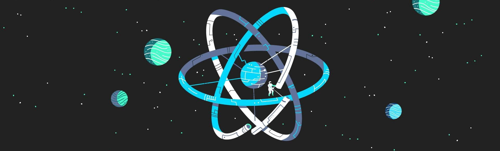
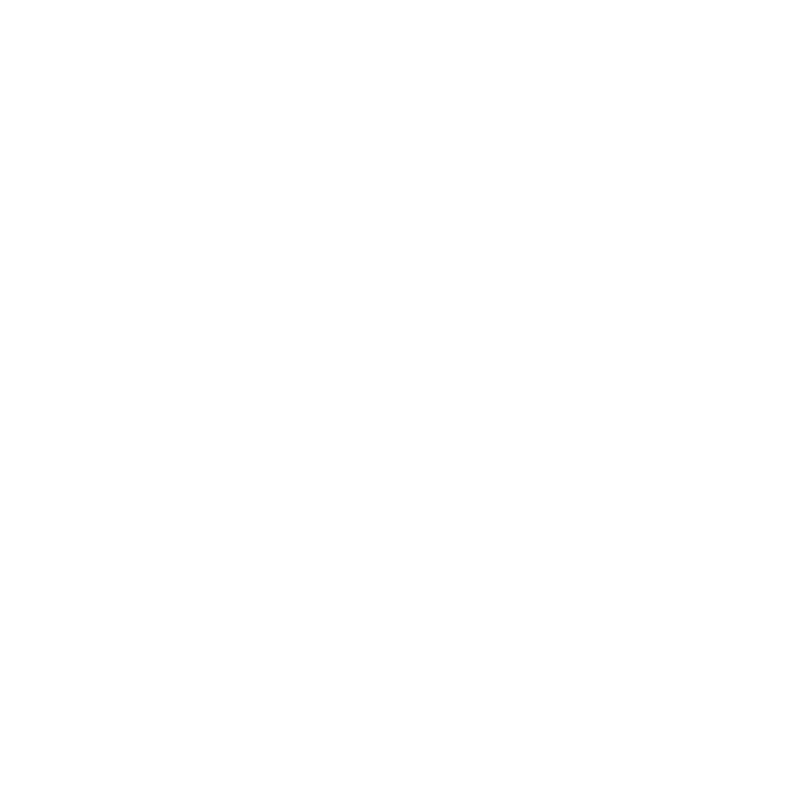

<!-- Banner -->

<!-- Title -->
# Hey 👋, I'm Mohammed Beltagy

<!-- Brief -->
#### I'm a Web Front-End Developer passionate about crafting engaging online experiences. I excel in translating designs into dynamic, user-friendly websites. My toolkit includes React.js and a blend of HTML, CSS, and JavaScript to build responsive and innovative digital solutions tailored to your needs. Let's create something awesome together!

 

<!-- Skills -->
## Technical Skills:
##### ⚛️ REACT.JS / NEXT.JS
##### 💻 HTML / CSS / JAVASCRIPT
##### 🚀 PUG / SASS / GULP
##### 🎨 MUI / BOOTSTRAP
##### 🗃️ REDUX & REACT-REDUX / ZUSTAND
##### ⚙️ FRMER-MOTION

 
 

<!-- Social Links -->

&nbsp;

&nbsp;

&nbsp;

